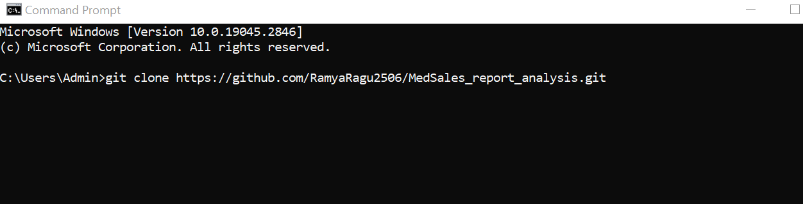
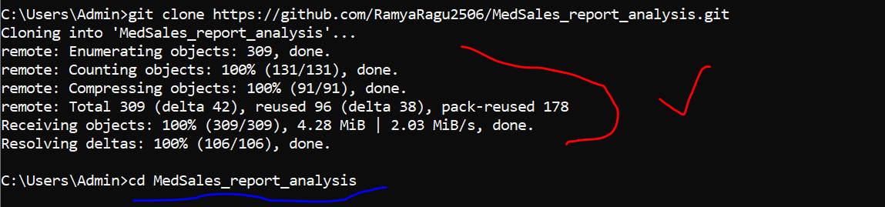
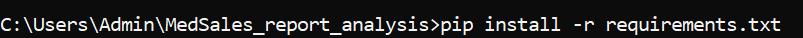
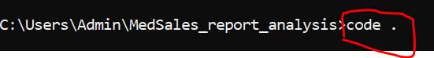
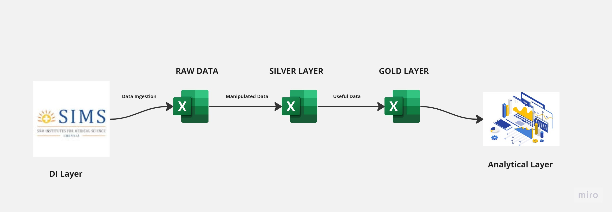

# SIMS Medical Sales analysis WebApp

SIMS Hospital is a leading healthcare provider in the region, offering a wide range of medical services and treatments to patients. As with any healthcare provider, understanding sales data is critical to the success of the hospital. Sales data can help SIMS Hospital track trends in patient demand, identify areas for improvement in services or marketing, and forecast revenue.

To make sense of sales data, SIMS Hospital can conduct sales analysis. This involves collecting and analyzing data on patient visits, treatments, and revenue. Sales analysis can help SIMS Hospital identify key metrics such as patient volumes, revenue by department, and average revenue per patient.

By conducting sales analysis, SIMS Hospital can gain insights into patient behavior, identify trends in revenue and expenses, and optimize resources to improve profitability. Additionally, sales analysis can help SIMS Hospital identify potential areas for growth, such as expanding services in high-demand departments or targeting specific patient demographics.

Overall, sales analysis is a critical tool for SIMS Hospital to understand its business and make data-driven decisions that improve patient outcomes and financial performance.

## Installation

1. Clone the repository.

`git clone https://github.com/RamyaRagu2506/MedSales_report_analysis.git`

2. Navigate to the root directory of the project.

`cd MedSales_report_analysis`

3. Install the required packages.

`pip install -r requirements.txt`

4. Install Visual Studio Code if it is not installed on the system. Go to https://code.visualstudio.com/download for installation

5. Use code . to open the python library codebased in VS Code.

## Usage

4. In the src\cleaning-notebooks, You can use the notebooks to clean the data that is provided according to the data that is required for the visualization. 
5. The data is piped through raw -> processed -> final
6. The final data used in app.py to visualize.
7. The raw data is never touched and used for ingestion purposed
8. However the processed data is the cleaned and silver layer data which comprises of manipulated data used for visualization.
9. Run the app.

`python app.py`

## Data Architecture

## Acknowledgements

Data - Provided by SIMS

## Contact

Author - Ramya Ragu
